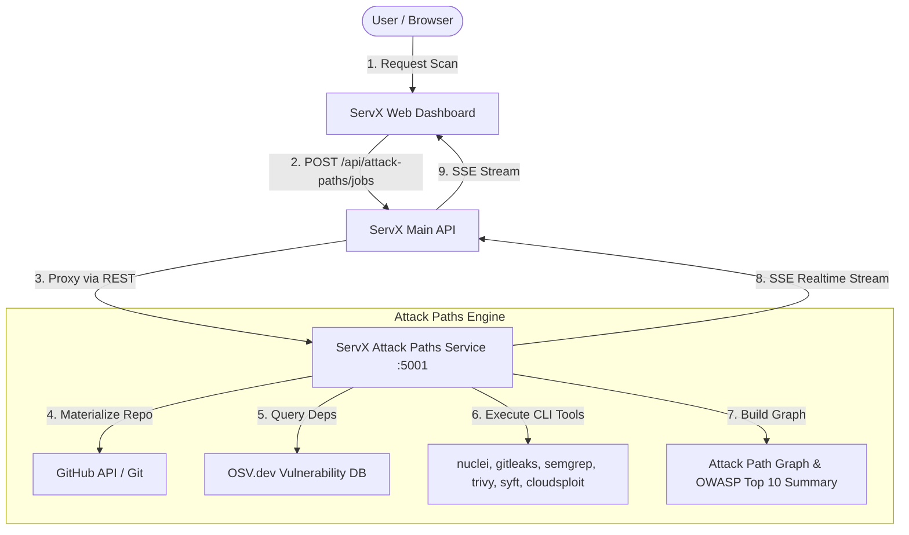

# ServX Attack Paths

**Dedicated Security Scanning, Vulnerability Analysis & OWASP Web Top 10 Assurance Engine for ServX.**

---

## 🏛️ Architecture Overview

`servx-attackpaths` is a specialized microservice decoupled from the main **ServX** control plane monorepo. It handles CPU-bound and network-intensive security scanning tasks, repository materialization, external vulnerability database queries, and attack graph generation without impacting the primary ServX API or web frontend.



---

## 🛡️ Integrated Security Scanners

The engine dynamically detects installed CLI tools and executes a comprehensive security suite:

1. **Secret & Credential Scanning (`gitleaks` + Built-in Regex Engine)**
   - Detects exposed AWS access keys, GitHub PATs, JWTs, basic auth tokens, and generic API keys.
2. **Static Application Security Testing (`semgrep` + Built-in SAST)**
   - Identifies injection vulnerabilities (SQLi, NoSQLi, Command Injection), unsafe DOM manipulation (`innerHTML`), and dynamic code evaluation (`eval`, `new Function`).
3. **Infrastructure as Code & Container Security (`trivy` + Built-in IaC Scanner)**
   - Checks Dockerfiles for root execution and missing healthchecks, Vercel configurations for missing CSP/CORS restrictions, and Terraform/Render configs for public bucket exposure.
4. **Software Bill of Materials & Supply Chain (`syft` + OSV.dev + GitHub Advisories)**
   - Generates SBOM inventory, queries OSV.dev for vulnerable npm dependencies, and aggregates open GitHub security advisories.
5. **Cloud Security Posture Management (`cloudsploit` + Built-in CSPM)**
   - Identifies cloud configuration files and environment variable leaks.
6. **Dynamic Application Security Testing (`nuclei` + Live HTTP Probes)**
   - Probes live target URLs for missing security headers (`HSTS`, `X-Content-Type-Options`, `X-Frame-Options`), wildcard CORS (`*`), and insecure session cookies.

---

## 🚀 API Endpoints

The service exposes a lightweight HTTP REST and Server-Sent Events (SSE) API on **Port 5001**:

### `POST /api/v1/jobs`
Initiates a new vulnerability and attack path scan job.
- **Request Body:**
  ```json
  {
    "requestedBy": "user_123",
    "repoId": "12345678",
    "repoFullName": "Servx-lab/ServX",
    "targetUrl": "https://servx.dev",
    "scanTypes": ["supply_chain", "secrets", "injection"],
    "analysisDepth": 2,
    "githubAccessTokenEnc": "encrypted_token",
    "githubTokenIv": "hex_iv"
  }
  ```
- **Response:**
  ```json
  {
    "jobId": "65f0a1b2c3d4e5f6a7b8c9d0",
    "status": "queued",
    "message": "Scan job initialized successfully."
  }
  ```

### `GET /api/v1/jobs/:id`
Retrieves the complete scan results, tool statuses, attack graph artifact, and OWASP Web Top 10 (2025) assurance summary.

### `GET /api/v1/jobs/:id/stream`
Server-Sent Events (SSE) endpoint streaming real-time phase updates and log events:
```http
event: progress
data: {"phase":"cpgraph_building","statusMessage":"Materializing repository files from GitHub..."}

event: completed
data: {"phase":"completed","statusMessage":"Real security scan completed"}
```

### `DELETE /api/v1/jobs/:id`
Aborts an active scan job and cleans up temporary sandbox directories.

---

## 🛠️ Getting Started

### 1. Prerequisites
- **Node.js** v20+
- **MongoDB** (Running locally or MongoDB Atlas)
- **Optional CLI Scanners** (For full capability):
  ```bash
  # Install tools via homebrew or Linux package managers
  brew install gitleaks semgrep trivy syft nuclei
  ```

### 2. Installation
```bash
git clone https://github.com/Servx-lab/servx-attackpaths.git
cd servx-attackpaths
npm install
```

### 3. Environment Configuration
Copy the example environment file and configure your encryption keys and MongoDB connection:
```bash
cp .env.example .env
```

### 4. Running the Development Server
```bash
npm run dev
```
The server will start on `http://localhost:5001`.

---

## 📦 Why Separate from ServX?

In the initial ServX monorepo, attack path scanning was embedded directly within the core API server and background worker. This separation was performed to achieve:
- **Resource Isolation:** Heavy static analysis tools and dependency queries no longer consume CPU and memory from the core ServX API.
- **Clean Dependency Tree:** Removes specialized scanning CLI wrappers and git materialization dependencies from the general web application workspace.
- **Independent Scaling:** The security scanning engine can be scaled independently on dedicated compute instances with specialized security tools pre-installed.
