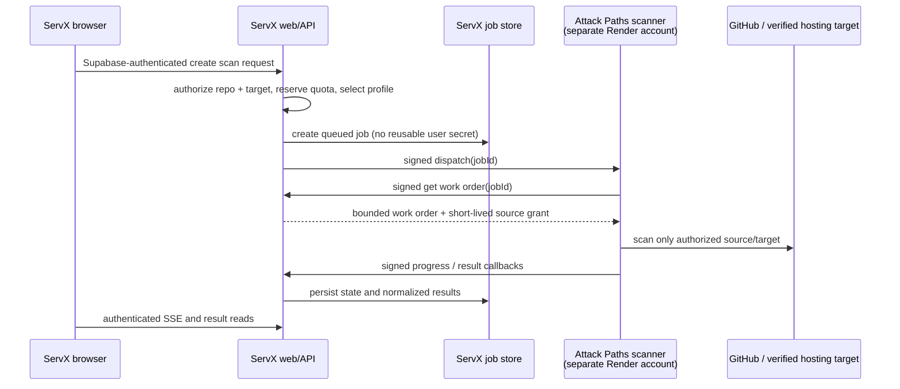

# ServX Attack Paths Integration Plan

## Status and decision

This document defines how the separate `servx-attackpaths` Render service integrates with the ServX product.

**Decisions**

- Keep the Attack Paths frontend in `ServX/apps/web`. It is a protected product page, not a separate application.
- Keep ServX API as the only browser-facing API and the authority for authentication, repository access, target ownership, quotas, job state, and results.
- Deploy this repository as a separate scanner worker in its own Render account. It is therefore an external HTTPS dependency, not a private Render service.
- Do not expose a browser-usable Attack Paths API key and do not let the browser call the scanner directly.
- Launch with a resource-bounded **Quick Scan**. Deep repository and active live-target scans are later opt-in worker profiles.

This is an architecture plan, not a claim that the current code already implements the target contract.

---

## 1. What exists today

### ServX frontend

`ServX/apps/web/src/pages/AttackPath.tsx` is the existing protected `/attack` experience. It already:

1. obtains the user's accessible repositories from `GET /api/github/repos`;
2. creates jobs at `POST /api/attack-paths/jobs`;
3. opens the authenticated SSE stream at `GET /api/attack-paths/jobs/:jobId/stream`; and
4. retrieves final results at `GET /api/attack-paths/jobs/:jobId`.

The shared Axios client obtains a Supabase session and attaches it as a bearer token. The frontend must continue to use this client; it must not receive the scanner URL or a scanner credential in `VITE_*` configuration.

The page currently supports both a selected GitHub repository and a free-form live URL. The free-form live URL is not acceptable for an active public scanner and is replaced in the target design with a verified deployment selection.

### ServX API and persistence

`ServX/apps/api/src/core/middleware/requireAuth.ts` verifies the Supabase bearer token and attaches a user id to `req.user`.

`ServX/apps/api/src/domains/attack-paths/` already contains the browser API boundary:

- `router.ts` protects creation, stream, and result routes with `requireAuth`.
- `requireAttackJobAccess.ts` ensures a job belongs to the requesting user.
- `attackPathsJobService.ts` persists queued jobs in MongoDB.
- `attackPathsController.ts` uses database polling to publish SSE progress every 1.5 seconds, with a current 15-minute stream limit.

The current Mongo `AttackPathsJob` document contains the job lifecycle, findings, tool status, graph artifact, and report data. It also persists encrypted GitHub OAuth-token material for the worker. That token-in-job design is a temporary legacy path and is removed from the target architecture.

### ServX worker and integrations

ServX already has a separate Node worker at `apps/worker`. Its Attack Paths runner is enabled only when `ATTACK_PATHS_WORKER=true`; otherwise the worker runs cache tasks and exits. The in-monorepo runner is more current than this repository in one important respect: it attempts to use a stored GitHub App installation token before falling back to a persisted OAuth token.

ServX also provides useful ownership evidence that the Attack Paths feature should reuse:

- `/api/github/repos` returns repositories accessible to the authenticated user and applies granular permissions.
- `servx_repositories` records registered repositories and their owner.
- Hosting connections for Render and Vercel return service/project URLs through `/api/connections/hosting/:provider/status`.
- Redis and the existing DEFCON/circuit-breaker patterns provide a natural global kill switch for scanning.

There is not yet a durable repository-to-hosting-service mapping. The first implementation can make the user explicitly choose a linked hosting service for a selected repository; a later mapping table can automate this.

### Standalone Attack Paths service

This repository starts an Express API and a Mongo-polled job loop after MongoDB connects. Its current `POST /api/v1/jobs`, result, stream, and cancellation routes are unauthenticated and its CORS policy is unrestricted. They must not be publicly used by the browser.

It also runs optional CLI scanners and Puppeteer. A normal Render Node deployment does not automatically install those CLIs, and the free web-service capacity is unsuitable for the full profile.

---

## 2. Target architecture



### Ownership boundaries

| Component | Owns | Must never receive |
| --- | --- | --- |
| Browser | UI state and Supabase user session | scanner credentials, GitHub/hosting secrets, direct worker access |
| ServX API | tenant authorization, quotas, token vault, job state, SSE, audit trail | unbounded scanner output or unverified target choices |
| Attack Paths worker | bounded scanner execution and normalized evidence | Supabase service role, hosting-provider keys, broad Mongo credentials, reusable user OAuth tokens |
| GitHub/hosting providers | repository and deployment evidence | arbitrary user-supplied scan targets |

---

## 3. Browser and frontend integration

### Keep the frontend where it is

The canonical page remains `ServX/apps/web/src/pages/AttackPath.tsx` under the existing `/attack` route. This preserves the dashboard shell, Supabase session, repository picker, Auto-Medic handoff, and user-level result access.

The frontend makes only these ServX API calls:

```text
POST /api/attack-paths/warmup                 optional, authenticated
POST /api/attack-paths/jobs                   create a scan
GET  /api/attack-paths/jobs/:jobId/stream     SSE progress
GET  /api/attack-paths/jobs/:jobId            final/saved result
```

No Attack Paths Render domain is embedded in the browser bundle.

### Warm-up behavior

On the first **authenticated dashboard** visit, ServX can asynchronously call `POST /api/attack-paths/warmup`. The page does not wait for this request and does not perform it on the public marketing page.

The ServX API sends a signed server-to-server request to the scanner's `/internal/wake` endpoint. This wakes a sleeping free Render web service before the user reaches `/attack`. If the scanner is cold when a user starts a scan, the UI shows `Starting scanner; this can take about a minute` and retries the dispatch safely.

The standalone service needs two distinct checks:

- `GET /health`: process liveness only; safe for a minimal uptime monitor.
- `GET /ready`: confirms Mongo/API connectivity and that the job processor has started. This is what ServX waits for before dispatching.

Do not implement the warm-up as a timer inside the scanner process: a sleeping container cannot run its own timer. Do not retain a free instance all day with a public browser ping. Let it sleep outside active use.

### Replace raw live URLs with verified deployments

The live scan panel changes from a raw URL input to a deployment selector:

1. User selects an authorized repository.
2. User selects a Render/Vercel service returned by the authenticated ServX hosting endpoint.
3. ServX resolves and validates the selected deployment URL server-side.
4. The job stores target provenance: `provider`, `connectionId`, `serviceId`, `resolvedUrl`, and `verifiedAt`.

An advanced manual URL flow, if ever added, requires an ownership challenge and SSRF protection before active scanning.

### UI states to add

- `warming`: scanner startup is in progress.
- `queued`: show position or `waiting for scan capacity`.
- `running`: phase, progress, and a non-sensitive status message.
- `partial`: report completed but some tools were deliberately unavailable or failed.
- `quota_exhausted`: show the time at which a new scan is allowed.
- `target_verification_required`: direct user to select/verify a deployment.

The UI should render scanner artifact names only after ServX has converted them into safe metadata or durable download URLs. It must never display raw worker filesystem paths.

### Preflight frontend work

`ServX/apps/web/src/pages/AttackPath.tsx` currently contains unresolved Git merge-conflict markers. Resolve that file before changing the page or relying on a production build. This document does not alter the ServX worktree.

---

## 4. ServX API integration

### Public API contract

The browser request becomes intentionally small:

```json
POST /api/attack-paths/jobs
{
  "repositoryId": "github-repo-id",
  "profile": "quick",
  "hostingTarget": {
    "provider": "render",
    "connectionId": "optional-connected-account-id",
    "serviceId": "optional-service-id"
  },
  "idempotencyKey": "uuid"
}
```

The browser does **not** supply `requestedBy`, a GitHub token, arbitrary `repoFullName`, raw scanner names, or a raw active-scan URL. ServX derives all of them.

On creation, the controller must:

1. verify the Supabase user;
2. confirm that the repository is in the user's permitted GitHub repository list and, where available, registered to the user;
3. resolve a hosting target only from the user's connected provider account;
4. apply quota, concurrency, idempotency, and global circuit-breaker checks atomically;
5. create the job; and
6. attempt signed dispatch to the scanner without exposing a dispatch failure to another user.

The existing `GET` result and SSE routes remain ServX-owned. SSE resumes from saved Mongo state after a reconnect; it never proxies a long-lived scanner connection.

### Internal service contract

The services authenticate each request with a versioned HMAC signature. Use separate keys in each direction and rotate by key id.

Required headers:

```text
X-ServX-Key-Id: scanner-v1
X-ServX-Timestamp: ISO-8601 UTC
X-ServX-Nonce: random UUID, single use
X-ServX-Content-SHA256: hex digest of request body
X-ServX-Signature: HMAC-SHA256(method + path + timestamp + nonce + digest)
```

Reject requests outside a five-minute clock window and store nonces temporarily to prevent replay. TLS remains mandatory.

Suggested internal endpoints:

| Direction | Endpoint | Purpose |
| --- | --- | --- |
| ServX -> scanner | `POST /internal/v1/wake` | start/check readiness without creating work |
| ServX -> scanner | `POST /internal/v1/dispatch` | offer one `jobId`; safe to retry |
| scanner -> ServX | `GET /internal/v1/jobs/:id/work-order` | obtain a sanitized, authorized work order |
| scanner -> ServX | `PATCH /internal/v1/jobs/:id/progress` | persist a phase/progress heartbeat |
| scanner -> ServX | `POST /internal/v1/jobs/:id/complete` | persist normalized results or failure |
| ServX -> scanner | `POST /internal/v1/heartbeat` | keep a Free web service awake during an allowed long job |

`dispatch` is idempotent by `jobId`; it returns `accepted`, `already_running`, `already_finished`, or a retriable availability error.

### GitHub source access

Target state: ServX issues a short-lived, repository-scoped GitHub App installation token only in the scanner work order, never stores it on the job, and never logs it. The scanner discards it after the work completes.

Migration state: the current API encrypts a user OAuth token into every job and the worker decrypts it. Do not copy this requirement into the separate Render service. If it is temporarily unavoidable, use a narrowly scoped migration plan and remove the persisted token fields before public launch; sharing the encryption key with the scanner would expand the blast radius too far.

### Job model changes

Add or migrate toward these fields in the ServX-controlled job record:

```text
profile: quick | deep_repo | verified_live
target: { provider, connectionId, serviceId, resolvedUrl, verifiedAt }
quota: { reservationId, chargedAt, refundedAt? }
dispatch: { state, attempts, lastAttemptAt, lastError? }
lease: { workerId, claimedAt, heartbeatAt, expiresAt }
attempt: number
expiresAt: Date          // TTL cleanup for old results where appropriate
```

Remove `githubAccessTokenEnc`, `githubTokenIv`, and `githubTokenExpiry` once the short-lived grant flow is live. Add a unique compound index for a non-empty idempotency key scoped to `requestedBy`.

### Rate and safety policy

Initial beta policy:

- three completed Quick Scans per user in a rolling 24-hour window;
- one queued/running job per user and one per repository/verified target;
- global scanner concurrency of one;
- a bounded queue (for example, ten waiting jobs); return `429` with `Retry-After` when full;
- reserve quota when accepted; refund only platform failures before scanning starts;
- global Attack Paths circuit breaker, controlled through the existing ServX operations pattern.

ServX, not the scanner, enforces this policy.

---

## 5. Scanner service design

### Service surface

The scanner's legacy public `/api/v1/jobs` browser-facing endpoints are removed, or changed to signed internal-only endpoints. CORS is disabled unless an explicit non-browser requirement exists.

The only unauthenticated endpoint should be a minimal liveness check if an external uptime monitor is used. It must not reveal scanner versions, queue state, environment variables, or job identifiers.

### Execution profiles

| Profile | Purpose | Initial tools | Render recommendation |
| --- | --- | --- | --- |
| `quick` | useful, low-cost evidence | GitHub alerts, batch OSV lookup, bounded config checks, passive HTTP security headers | Free web service for demo only |
| `deep_repo` | complete source/config scan | Gitleaks, Semgrep, Trivy filesystem/IaC, optional Syft | paid worker with pinned Docker image |
| `verified_live` | active scan of an owned deployment | safe Nuclei templates; optional ZAP baseline later | paid isolated worker only |

CloudSploit requires explicit cloud-account consent and read-only credentials. TruffleHog credential verification and ZAP are opt-in because they create additional external traffic and risk.

The Quick Scan should avoid Puppeteer and active Nuclei. It is the only profile appropriate for the free-account warm-on-demand experiment.

### Resource boundaries

Every scan profile requires limits for:

- total runtime and per-tool runtime;
- one process at a time initially;
- repository file count, individual file size, and total fetched bytes;
- scanner stdout/stderr and result size;
- redirect count, response size, and request rate;
- temporary workspace size and deletion in `finally`;
- job lease expiry and stale-job recovery after process restart.

For verified live scans, permit HTTPS and intended ports only; resolve DNS and block loopback, private, link-local, multicast, and cloud-metadata ranges before every request/redirect. Browser subresource requests need the same protection. Scan only a ServX-verified deployment URL.

### Docker and secrets

Deep profiles use a Docker image that pins Node, scanner versions, and Chromium dependencies. Run as an unprivileged user and avoid placing broad cloud/provider credentials in the scanner process. The current Puppeteer `--no-sandbox` mode is not acceptable for multi-tenant active scans without strong isolation.

The scanner Render account holds only:

```text
SERVX_CONTROL_PLANE_URL
SERVX_TO_SCANNER_HMAC_KEY_<id>
SCANNER_TO_SERVX_HMAC_KEY_<id>
SCANNER_WORKER_ID
```

It does not hold the Supabase service-role key, a general GitHub OAuth token, Vercel/Render account tokens, or the ServX-wide encryption key.

---

## 6. Render operating model

### Free-account experiment

The separate Render account is acceptable for a small beta because it isolates the scanner's billing and deploy lifecycle. It does not create private connectivity to the main ServX account.

For the Quick Scan experiment:

1. Deploy the scanner as a Free **web service**, not a background worker.
2. Allow it to sleep while no user has asked for scanning.
3. Warm it with the signed ServX API call after the first authenticated dashboard visit, or immediately when a scan is created.
4. Use `ready` before dispatching.
5. Keep an active scan awake with a signed heartbeat only when its expected duration needs it.
6. On cold start, preserve the job in ServX and retry dispatch; never rely on scanner-local memory or files.

An external cron health ping can help demonstration uptime, but it should not be the normal always-on production strategy. It consumes free running hours, does not prevent platform restarts, and does not make the full scanner fit free capacity.

### Production model

Move `deep_repo` and `verified_live` to a paid background worker or workflow with at least one dedicated execution slot. The web/control plane stays responsive; workers accept only signed, already-authorized work.

---

## 7. Implementation phases

### Phase 0 — establish a clean baseline

1. Resolve `AttackPath.tsx` merge-conflict markers in ServX.
2. Choose one canonical scanner runner. Do not let `ServX/apps/worker` and this repository drift as separate copies.
3. Add a contract-test fixture for job state, findings, tool status, graph artifact, and assurance summary.
4. Add Docker support and explicit readiness to this repository; do not assume optional npm dependencies provide CLI binaries.

### Phase 1 — safe Quick Scan integration

1. Add ServX `warmup` and signed service-client modules.
2. Change job creation to server-derived repository and hosting target fields.
3. Implement HMAC verification, `ready`, and `dispatch` in this service.
4. Implement an API-mediated work-order/progress/completion flow.
5. Add quota, idempotency, queue limit, circuit breaker, and audit records.
6. Replace the frontend raw live URL field with a connected deployment selector.
7. Deploy as a Free web-service demo and test sleep/cold-start/retry behavior.

### Phase 2 — repository-quality scanning

1. Implement short-lived GitHub App source grants.
2. Fetch complete, bounded source material including lockfiles rather than only a prioritised subset of source files.
3. Use batched dependency queries and normalize GitHub/OSV findings.
4. Add Gitleaks, Semgrep, and Trivy in a pinned worker image.
5. Clean temporary workspaces and retry/recover expired job leases.

### Phase 3 — verified active scanning

1. Add repository-to-hosting-service association and ownership verification.
2. Enable safe Nuclei templates for verified deployments.
3. Add explicit user consent, detailed target audit data, and per-target rate limits.
4. Consider ZAP baseline only after isolation, cost, timeout, and legal controls are proven.

---

## 8. Verification checklist

### Security

- Browser cannot reach a scanner job/dispatch endpoint with a valid credential.
- A user cannot create a job for another user's repo or hosting service.
- HMAC requests reject stale timestamp, replayed nonce, altered body, unknown key id, and invalid signature.
- Scanner receives no reusable user OAuth token or broad ServX secret.
- A live scan rejects internal/private/metadata addresses and unverified redirect targets.
- Cancelling a job stops queued work and prevents later dispatch.

### Reliability

- A cold scanner returns to `ready` and a queued job is retried without duplicate execution.
- A scanner restart causes an expired lease to be retried or marked failed with a clear reason.
- SSE reconnect shows persisted progress and final result.
- Scanner filesystem state is unnecessary after any restart.
- Queue full, quota full, and circuit-breaker-open responses are explicit in the UI.

### Product

- `/attack` continues to work using the existing ServX bearer-token flow.
- Quick Scan result labels distinguish `completed`, `partial`, `skipped`, and `failed` tools.
- The report has target provenance and does not leak secrets, raw response bodies, worker paths, or token values.
- Auto-Medic receives normalized findings plus repo and verified target context.

---

## 9. Open decisions before implementation

1. Which GitHub App permissions and token-minting path are available in the ServX deployment?
2. Is MongoDB reachable from the separate Render account, or should the API-mediated work-order design be implemented immediately? The latter is the preferred security boundary.
3. Which provider connection/service should be explicitly associated with each registered repository?
4. What exact Quick Scan time, byte, and queue budgets fit the chosen free service empirically?
5. Where will durable report artifacts live when deep scans are introduced?
6. What user consent and legal language is required before active scanning is enabled?

## References in the current codebase

- `ServX/apps/web/src/pages/AttackPath.tsx`
- `ServX/apps/web/src/lib/apiClient.ts`
- `ServX/apps/api/src/core/middleware/requireAuth.ts`
- `ServX/apps/api/src/domains/attack-paths/`
- `ServX/apps/api/models/AttackPathsJob.js`
- `ServX/apps/api/src/domains/github/`
- `ServX/apps/api/src/domains/connections/service.ts`
- `ServX/apps/api/src/domains/repositories/`
- `ServX/apps/worker/src/jobs/attackPaths/`
- `servx-attackpaths/src/server.ts`
- `servx-attackpaths/src/engine/attackPathsJobRunner.ts`
