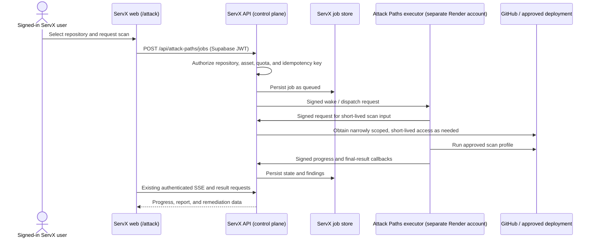

# ServX Attack Paths integration plan

## Decision

Attack Paths is a **ServX capability**, not a separate end-user application.

- Keep the user interface in `ServX/apps/web`, on the existing protected `/attack` route.
- Keep user authentication, tenancy, GitHub/hosting credentials, quotas, job records, results, and SSE in `ServX/apps/api`.
- Deploy this repository as the independently operated **scan executor** on the separate Render account.
- Treat the executor as an external public-internet dependency. It must not be called by browsers, and it must not receive ServX's database, Supabase, GitHub, or hosting-provider master credentials.

This preserves the existing ServX dashboard experience while isolating expensive and higher-risk scanning work.

## Implementation status — 2026-07-19

Phase 1 is implemented across this repository and the local `ServX` control
plane repository:

| Area | Delivered now |
| --- | --- |
| Executor boundary | Removed browser-facing job routes and permissive CORS; added HMAC-protected ready, wake, and dispatch routes. |
| Trust | Requests carry signed method/path/body/timestamp/nonce values. ServX uses Redis-backed replay rejection for executor callbacks. |
| Job bridge | The executor receives only a job id, atomically claims a short-lived ServX lease, fetches scan input from a ServX internal route, and returns lease-bound signed progress/results. It has no ServX Mongo or encryption-key dependency. |
| User policy | Server-side repository authorization, a three-repository-scan rolling-24-hour quota, per-user/repository active-job rejection, and client idempotency keys. |
| Free-tier UX | The `/attack` evidence rail shows warming, queue position, live scanner stages, partial coverage, cancellation, and a table-first findings desk. Manual live URLs are disabled. |
| Executor cost control | One serial executor, a bounded ServX queue, byte-capped shallow clone, pinned scanner image and Semgrep rule commit, per-tool deadlines, temporary workspace cleanup, and graceful shutdown draining. |
| Recovery | The API requeues expired executor leases every minute, safely re-dispatches persisted queued jobs, rejects stale callbacks, and records queue/run metrics. |
| Deployment | `render.yaml`, executor-only environment template, and deployment notes. |

The initial implementation includes durable lease recovery, retry dispatch,
cancellation, run metrics, and a deployment-wide admission/dispatch stop
(`ATTACK_PATHS_KILL_SWITCH=true`). It does **not** claim a production
active-scan capability: deployment ownership verification, network isolation,
and verified live testing remain follow-up work. Deep repository scanning is
enabled for the small, owned-repository beta; active live scanning is not.



## What exists today

The current ServX implementation already supplies much of the control plane:

| Capability | Existing location | Integration consequence |
| --- | --- | --- |
| Protected Attack Paths UI | `ServX/apps/web/src/pages/AttackPath.tsx` | Keep this page; it already creates jobs, consumes SSE, normalizes findings, and renders the report. |
| Browser authentication | `ServX/apps/web/src/lib/apiClient.ts` and `apps/api/src/core/middleware/requireAuth.ts` | The browser presents a Supabase bearer token to ServX only. |
| Job API and ownership checks | `apps/api/src/domains/attack-paths/*` | Preserve the public API shape so the frontend does not need the executor URL. |
| Durable job state | `apps/api/models/AttackPathsJob.js` in MongoDB | ServX remains authoritative for status and results. |
| Repository picker and granular access filtering | `apps/api/src/domains/github/controller.ts` | Reuse the same server-side access policy when accepting a scan request. |
| Registered repositories | `apps/api/src/domains/repositories/service.ts` | Use registered repositories as the first allowed scan set. |
| Vercel/Render service discovery | `apps/api/src/domains/connections/service.ts` | Use connected service URLs as approved live-scan targets instead of an arbitrary URL field. |
| SSE | `apps/api/src/domains/attack-paths/controllers/attackPathsController.ts` | The executor posts events to ServX; ServX continues streaming to the browser. |
| Redis/circuit breaker conventions | `apps/api/src/core/services/redisCache.ts` and operations domain | Use Redis for nonce replay protection, dispatch retry state, and a scanner kill switch when configured. |

There are also two current implementations of the runner: one in this repository and one under `ServX/apps/worker/src/jobs/attackPaths`. They have already drifted; for example, the ServX copy prefers an installation token while this repository only decrypts the token stored in the job. The standalone repository should become the canonical executor, then the duplicate runner in the monorepo should be removed or reduced to a compatibility shim.

## Current gaps to close before integration

1. The ServX job controller validates the request shape but does not prove that `repoId` and `repoFullName` belong to the authenticated user. The UI picker is not a sufficient authorization boundary.
2. The controller persists an encrypted GitHub OAuth token in every job. A separate executor would need the same encryption key to decrypt it, which defeats isolation.
3. The executor's current `/api/v1/jobs` routes are unauthenticated and it enables permissive CORS. These routes must not be reachable by clients.
4. The executor accepts arbitrary `targetUrl` values and then uses a browser and active scanners. This must be replaced with an owned, verified deployment asset.
5. `idempotencyKey` is stored but not enforced. There is no per-user quota, active-job limit, or queue ceiling.
6. A claimed job has no lease/recovery policy. A restart can leave it permanently in a running state.
7. The current worker scans up to six tools sequentially and can run Chromium. That is not a suitable default workload for a Render Free instance.
8. The current health endpoint only proves the HTTP process is listening. It does not prove Mongo/worker readiness.

## Target responsibilities

### ServX control plane

ServX is the policy enforcement point. It is responsible for:

- validating the Supabase session and applying existing ServX permissions;
- resolving `repoId` and `repoFullName` against the user's currently authorized GitHub repositories;
- resolving a requested deployment target from a user-owned, connected Vercel or Render service;
- enforcing quotas and idempotency before a job is created;
- recording all job state, audit information, findings, and user-visible results;
- dispatching work and verifying executor callbacks;
- exposing only the existing authenticated `/api/attack-paths/*` endpoints to the frontend;
- issuing narrowly scoped, short-lived source access only after a job is accepted.

### Attack Paths executor

The Render service is responsible only for execution:

- receiving a signed wake or dispatch request from ServX;
- obtaining the current scan input through a signed ServX internal endpoint;
- running the selected profile within fixed time, file, output, and concurrency limits;
- posting signed progress and final results back to ServX;
- deleting temporary workspaces after every run;
- exposing a minimal liveness/readiness surface and no user-facing API.

The executor must not have:

- a Supabase service-role key;
- a broad MongoDB connection string;
- a reusable GitHub OAuth token, GitHub App private key, Vercel token, or Render token;
- an `ENCRYPTION_KEY` shared with ServX;
- any route intended for a browser.

## Service-to-service contract

Because the services are in separate Render accounts, calls cross the public internet. TLS is necessary but not sufficient; both directions require application-layer authentication.

### Signed request format

Use a shared HMAC secret stored independently in each service's encrypted environment configuration. Do not expose it to the web app.

Each request includes:

```text
Authorization: ServX-HMAC v1
X-ServX-Key-Id: scanner-2026-01
X-ServX-Timestamp: <unix seconds>
X-ServX-Nonce: <random UUID>
X-ServX-Content-SHA256: <hex SHA-256 body digest>
X-ServX-Signature: v1=<hex HMAC-SHA256>
```

Sign this canonical value:

```text
METHOD + "\n" + PATH + "\n" + TIMESTAMP + "\n" + NONCE + "\n" + CONTENT_SHA256
```

The receiver must reject an unknown key id, timestamps older than five minutes, an invalid body digest/signature, and a reused nonce. Store nonce keys in Redis with a short TTL; if Redis is unavailable, fail closed for executor requests rather than silently bypassing replay protection.

Use separate key ids/secrets for `control-plane -> executor` and `executor -> control-plane`, and support a short overlap window for rotation.

### Internal executor endpoints

| Endpoint | Caller | Purpose | Expected response |
| --- | --- | --- | --- |
| `GET /health` | Anyone | Minimal liveness check; contains no sensitive information. | `200` if process is listening. |
| `GET /ready` | ServX API | Authenticated readiness check. It reports whether configuration and the job dispatcher are initialized. | `200 ready`, otherwise `503`. |
| `POST /internal/v1/wake` | ServX API | Idempotently initialize the executor after a cold start. It does not create a job. | `202` or `200`. |
| `POST /internal/v1/jobs/:jobId/dispatch` | ServX API | Request execution of a job that ServX already created. | `202`; must be idempotent. |
| `POST /internal/v1/jobs/:jobId/heartbeat` | ServX API | Keep a long active job alive only when required by a Free web-service deployment. | `204`. |

`/health` is safe for a monitor. The other endpoints require HMAC verification and should return a generic error body on failure.

### Control-plane endpoints for executor callbacks

Add a small internal router in ServX, protected by the reverse HMAC key:

| Endpoint | Purpose |
| --- | --- |
| `GET /api/internal/attack-paths/jobs/:jobId/input` | Returns the sanitized job input after checking the executor signature and job state. |
| `POST /api/internal/attack-paths/jobs/:jobId/progress` | Records a validated phase/progress update. |
| `POST /api/internal/attack-paths/jobs/:jobId/complete` | Records normalized results, tool status, and completion metadata. |
| `POST /api/internal/attack-paths/jobs/:jobId/fail` | Records a bounded failure code/message and releases active capacity. |

The executor receives a job id in the dispatch request. It does **not** receive the complete job document. ServX keeps control of the job state and makes a specific input available only while a job has a valid execution lease.

## GitHub and source access

### Required change

Do not copy `githubAccessTokenEnc`, `githubTokenIv`, or `ENCRYPTION_KEY` to the separate Render account. Remove those fields from the data sent to the executor once the new contract is live.

### Recommended flow

1. ServX confirms the user can scan the chosen repository.
2. ServX creates a short execution lease, for example 15 minutes.
3. When the executor requests job input, ServX obtains or mints a GitHub App installation token scoped to that repository with only the required permissions (`contents:read`, and security-alert read permissions when enabled).
4. ServX returns the short-lived token over the signed, TLS-protected request. The executor keeps it only in process memory and never writes it to the job, logs, artifacts, or callback payload.
5. ServX rejects subsequent input requests after the lease expires or the job finishes.

If GitHub App token minting is not ready yet, a temporary alternative is a dedicated scanner credential with read-only access only to a small allowlist of pilot repositories. It is still better than copying every user's OAuth token and the shared encryption key to the executor.

## Scan profiles

Profiles prevent a free-tier preview from pretending to be an unbounded security platform.

### `quick` — bounded fallback

Runs on the free Render web service and must have a short, deterministic budget.

- Pull GitHub Dependabot, secret-scanning, and code-scanning alerts where the linked repository enables them.
- Read package manifests and lockfiles; send dependency checks in batches instead of one OSV request per package.
- Run bounded source/config checks against selected source files, Dockerfiles, GitHub Actions, `render.yaml`, and `vercel.json`.
- Run passive deployment checks only against a verified connected deployment: HTTPS, redirects, headers, CSP, CORS, and cookie flags.
- Produce evidence references, affected paths, remediation guidance, and an attack-path graph.

Do not run Chromium, Nuclei, ZAP, CloudSploit, secret verification, or a full repository-history scan in this profile.

### `deep_repo` — queued interactive default

- Fetch a byte-capped shallow clone of an already-authorized repository. The
  default cap is 100 MiB and the hard cap is 250 MiB; no submodules or symlinks
  are retained.
- Run Gitleaks, Semgrep, Trivy filesystem/IaC, and optional Syft SBOM generation in a pinned Docker image.
- Limit to one global concurrent scan on the free executor until metrics prove more capacity is safe.
- Use clone and per-tool deadlines, bounded captured command output, disk cleanup, a post-clone byte limit, and whole-job cancellation that terminates the active scanner process. Raw scanner artifacts remain transient; only normalized evidence is returned to ServX.

### `verified_live` — paid worker and explicit opt-in

- Starts only after the user selects a deployment asset owned by a connected hosting account or completes domain-ownership verification.
- Permit HTTPS and an allowlisted port set only.
- Resolve DNS before every connection and redirect; block loopback, link-local, private, carrier-grade NAT, multicast, and cloud metadata addresses for both IPv4 and IPv6.
- Begin with a safe, curated Nuclei template subset. Make ZAP and active payload scanning a separate explicit consent level.

## Queue, quota, and recovery design

MongoDB remains the durable source of truth for the initial launch. Redis is useful for locks, nonces, and notifications, but the free Redis tier must not be the only record of a scan.

### New job fields

Add fields similar to the following to the ServX job model:

```text
profile: "quick" | "deep_repo" | "verified_live"
targetAssetId: string | null
targetUrlSnapshot: string | null
idempotencyKey: string
dispatchState: "pending" | "accepted" | "retrying"
executionLeaseId: string | null
leaseExpiresAt: Date | null
attemptCount: number
queueReason: string | null
quotaReservationId: string
executorVersion: string
```

Index at minimum on `(requestedBy, createdAt)`, `(status, createdAt)`, `(executionLeaseId)`, and a scoped idempotency key. Retain a compact immutable audit event list separately from the mutable job document.

### Initial policy

- Three repository jobs (`quick` or `deep_repo`) per user in a rolling 24-hour period.
- One queued or running job per user, repository, and target asset.
- One global concurrent repository job on the free executor.
- A bounded global queue; reject excess jobs with `429` and a `Retry-After` value instead of accepting work that cannot be served.
- Reserve quota atomically when creating the job. Refund only a confirmed ServX/executor infrastructure failure, not invalid input, cancellation, or an authorization failure.
- Generate an idempotency key once per scan-button action; repeat requests must return the original job.
- A reaper marks expired leases as retryable or failed and releases quota/capacity. No job may remain in an active phase indefinitely.

## Frontend integration

The existing `AttackPath.tsx` page should remain the only frontend. It already uses `apiClient`, Supabase sessions, the current job-create endpoint, authenticated SSE, and final-result loading.

### Changes to make in ServX web

1. Add a non-blocking `POST /api/attack-paths/warmup` call after an authenticated user enters the dashboard or opens `/attack`. The browser calls ServX; ServX calls the executor. Never reveal the executor URL to the browser.
2. Add `warming` and `queued` UI states. Explain a cold start plainly, then continue polling/SSE through ServX.
3. Replace the arbitrary live URL as the default path with a deployment-asset selector populated from the user's connected Vercel/Render services. Keep manual domain verification as a later explicit flow.
4. Present `deep_repo` as the available beta scan. Show remaining daily allowance, queue position, and the reason a scan cannot start.
5. Handle `429`, a failed cold start, expired GitHub authorization, and a killed scan as first-class user states.
6. Keep sensitive artifacts out of the UI unless a later authenticated download endpoint authorizes them. Paths on the executor filesystem are not valid user-facing artifact URLs.

The current UI can continue using:

```text
POST /api/attack-paths/jobs
GET  /api/attack-paths/jobs/:jobId/stream
GET  /api/attack-paths/jobs/:jobId
```

Extend the create response with `status`, `profile`, `queuePosition` when known, `quotaRemaining`, and a user-safe `phaseMessage`.

## ServX API integration work

1. Add `assertScanRepositoryAccess(userId, repoId, repoFullName)`. It must fetch/validate the repository server-side and apply ServX granular permissions; do not trust the frontend value.
2. Add an asset relationship for a repository and a connected hosting service. For the first version, allow the user to select a service and store the verified service id/domain snapshot on the job.
3. Move quota, idempotency, and active-job checks into the job-creation service, before the insert.
4. Create an internal executor router with HMAC middleware and callback validators.
5. Create a dispatch client with timeout, retry, and audit logging. It should send a wake/dispatch after the job commit, but a dispatch failure must not lose the durable job.
6. Refactor the current controller so it never writes OAuth-token material to a job for the new executor path.
7. Keep the existing SSE and ownership middleware. They are a good boundary because the browser remains attached only to ServX.
8. [x] Add the deployment-wide `ATTACK_PATHS_KILL_SWITCH`. Setting it to `true` blocks new jobs, warmups, recovery dispatches, and controller dispatches; active work is left to finish or can be cancelled by the user.

## Executor integration work in this repository

1. Delete or disable the public user job API. Replace it with HMAC-protected wake, dispatch, and readiness routes.
2. Add a worker-dispatch layer that processes a supplied job id and fetches sanitized input from ServX. It must tolerate a duplicate dispatch.
3. Replace all direct Mongo status writes with signed ServX progress/complete/fail callbacks.
4. Remove job-token decryption and the need for `MONGODB_URI`/`ENCRYPTION_KEY` from the deployed executor.
5. Add a Dockerfile that pins Node, scanner binaries, and browser dependencies. The current optional npm dependencies do not guarantee the expected scanner CLIs are present on Render.
6. Add `GET /ready` that confirms configuration, accepted HMAC key configuration, and dispatcher initialization. It must return `503` until it is genuinely ready.
7. Add limits: accepted scan profile, file count/individual size/total bytes, process time, process output, artifact output, temporary disk use, and cleanup in `finally`.
8. Redact secrets in all findings and logs. Return fingerprints and locations, never raw credential values or arbitrary response bodies.
9. Keep expanding integration coverage for HMAC verification, replay rejection, duplicate dispatch, cancellation, lease expiry, private-target blocking, and callback authorization. Unit coverage currently verifies scanner normalization, target rejection, and source-local candidate construction.

## Render deployment and cold-start behaviour

The separate Render account is acceptable for isolation, but it requires the public signed contract above. There is no same-workspace private network between accounts.

### Free beta operation

- Deploy the executor as a Free **web service** because it needs an inbound signed dispatch to wake it.
- Let it sleep when unused. A scan dispatch is the functional wake-up fallback.
- Optionally call the ServX warm-up endpoint once on an authenticated dashboard session to hide the cold start before a user opens Attack Paths.
- Do not use a timer inside the executor to keep itself awake; it stops when the service sleeps.
- Do not keep it awake all day by default. An external 10-minute `GET /health` monitor is acceptable only for a personal demo, consumes nearly all available free instance time, and does not make the service reliable.
- A running deep job is intentionally serial and may be slow. Persist each stage
  in ServX so the user can keep the page open or return later; do not use a
  public cron keepalive to manufacture uptime.

### Paid expansion

Move `verified_live` and any higher-capacity `deep_repo` tier to a dedicated
background worker or higher-capacity service. Start with one concurrent
execution, collect CPU/RAM/duration/egress metrics, then tune capacity. The
free executor must not be silently upgraded into an unbounded multi-tool DAST
worker.

## Delivery sequence

### Phase 1 — safe quick-scan bridge

1. Add HMAC middleware and ServX internal routes.
2. Add repository authorization, idempotency, and quota enforcement.
3. Convert the executor to signed wake/dispatch/callback flow.
4. Implement `/ready`, warm-up, and a user-visible queued/warming state.
5. Restrict `quick` to GitHub-native alerts, batched dependency checks, bounded source/config checks, and passive verified-asset checks.
6. Deploy the executor to the separate Render account; configure only its own HMAC direction, ServX base URL, and repository-scan limits.

### Phase 2 — harden and observe

1. [x] Add leases, reaper, retries, cancellation, and a kill switch. Audit events remain follow-up work.
2. Add resource limits, cleanup, redaction, and integration tests.
3. Record runtime, failure reason, queue delay, and quota metrics in ServX.
4. Verify each UI state: cold start, queued, active, partial result, completed, rate limited, disabled, and failed.

### Phase 3 — deep-scan hardening and paid expansion

1. [x] Introduce the pinned Docker executor image and serial `deep_repo` profile.
2. [x] Add Gitleaks, Semgrep, Trivy, and Syft behind `deep_repo`.
3. Add repository/deployment ownership proof and SSRF controls before any `verified_live` active scan.
4. Offer active DAST as an explicit opt-in, not as a default side effect of selecting a URL.

## Acceptance criteria for Phase 1

- A signed-in user can select only a repository they are authorized to access.
- The browser never knows the executor URL, service secret, Mongo connection string, GitHub OAuth token, or encryption key.
- A duplicate create request produces one job and one quota reservation.
- Three repository scans in 24 hours are enforced server-side.
- A cold executor start is represented as `warming`/`queued`, not as an unexplained client error.
- The executor can restart without leaving an active job permanently stuck.
- The displayed result is read through ServX's existing ownership-checked endpoints.
- An arbitrary local/private URL cannot be scanned.
- Disabling the `attack_paths` circuit breaker stops new dispatches immediately.
- The executor can be allowed to sleep with no loss of durable job state.

## Files likely to change

### ServX

- `apps/web/src/pages/AttackPath.tsx`
- `apps/api/src/domains/attack-paths/controllers/attackPathsController.ts`
- `apps/api/src/domains/attack-paths/services/attackPathsJobService.ts`
- `apps/api/src/domains/attack-paths/router.ts`
- `apps/api/models/AttackPathsJob.js`
- new `apps/api/src/domains/attack-paths/internal/*`
- new `apps/api/src/domains/attack-paths/services/scanAuthorization.ts`
- new `apps/api/src/domains/attack-paths/services/executorClient.ts`
- `apps/api/src/domains/connections/*` for repository-to-deployment asset selection
- `apps/api/src/core/services/circuitBreaker.ts` for the attack-paths circuit

### This repository

- `src/server.ts`
- `src/api/routes.ts` and `src/api/controller.ts`
- `src/engine/attackPathsJobRunner.ts`
- new service-auth, ServX client, dispatch, resource-limit, and cleanup modules
- `Dockerfile` and deployment configuration
- tests for the signed contract and execution controls

## Explicit non-goals for the beta

- A standalone Attack Paths frontend or login system.
- Direct browser access to the scanner.
- Arbitrary public URL scanning.
- Persistent secrets, raw credential values, or raw browser response bodies in reports.
- Always-on free-tier scanning via an unbounded external cron keepalive.
- Full CI/CD security-platform parity on the first release.
